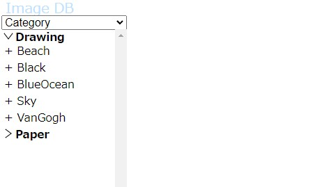
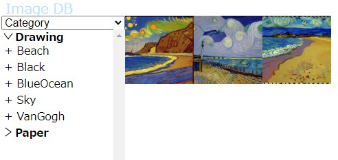
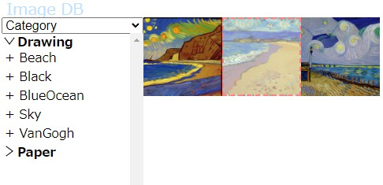
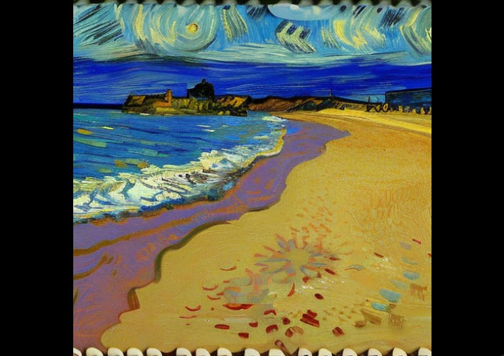

# ImageDB
Simple Image Management System Using Node.js.


## Setup

At first, install Node.js v18, clone this repository, and install npm modules by `npm install` command.
```
$ git clone https://github.com/astnohk/ImageDB.git
$ cd ImageDB
$ npm install
```


## Register your images

`$ npm run store /path/to/your/images/directory`
or
`$ node store.js /path/to/your/images/directory`.

ImageDB assume image files named according to following rules:
* File name has `_` separated "category name" and "tags".
* Category name is specified at first part.
* File name could have numbers such as `1234` to distinguish images which has fully same category and tags.
* File name could have page numbers such as `p01` to distinguish images which has fully same category, tags and numbers.

e.g. `Category_Tag1_Tag2_0123_p01.jpg`.


## Start server

`$ npm run start`
or
`$ node server.js`.

And open `https://127.0.0.1:8443` in your browser. It shows the main window as below:



Tags will be shown if you click on `>` mark at the left of category name. You also be able to load some images by clicking on category or tags in left column.



Images can be moved by drag and drop.



`click` or `tap` on the image to open full size image viewer. The image will automatically be shrinked/magnified to fit to the window.  
You can move to prev/next image by arrow keys (`←`, `→`) or `wheel up`/`wheel down`. You can delete the image from current workspace by pressing `del` key or swipe up over half of your touch display.




### Other features

#### Clean-up DB

`$ npm run clean` or `$ node store.js --clean` will clean-up your DB. It will delete all broken links (file is not exists).

#### Stats

`$ npm run stats` or `$ node store.js --stats` shows count of unique images, categories, directories and playlists.
