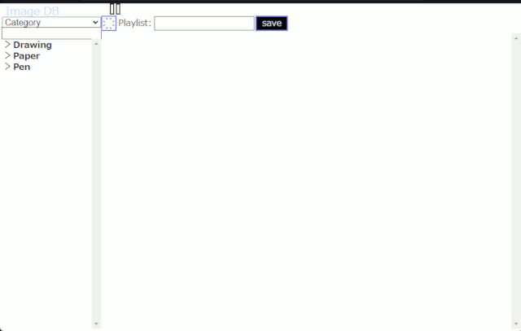
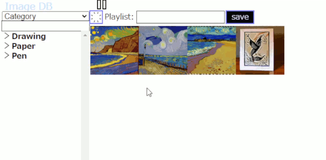
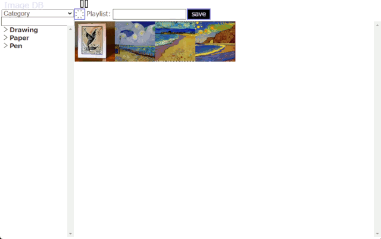

# ImageDB
Simple Image Management System Using Node.js.

It parses filename of images such as `"Category_Subcategory1_Subcategory2_1234_p01.jpg"` and insert them into the DB.
You can find images from the list filtered by *Category*, *Subcategory*, *Directory* or *Playlist* that you created.
Playlists can be easily modified on the WebGUI. You can dragg&drop the image to reorder your sequence as desired.
Vertical split mode leads you to easy way of creating massive image playlists.


## Setup

At first, install Node.js v18, clone this repository, and install npm modules by `npm install` command.
```
$ git clone https://github.com/astnohk/ImageDB.git
$ cd ImageDB
$ npm install
```


## Register your images

`$ npm run store /path/to/your/images/directory`
or
`$ node store.js /path/to/your/images/directory`.

ImageDB assume image files named according to following rules:
* File name has `_` separated "category name" and "tags".
* Category name is specified at first part.
* File name could have numbers such as `1234` to distinguish images which has fully same category and tags.
* File name could have page numbers such as `p01` to distinguish images which has fully same category, tags and numbers.

e.g. `Category_Tag1_Tag2_0123_p01.jpg`.


## Start server

`$ npm run start`
or
`$ node server.js`.

And open `https://127.0.0.1:8443` in your browser. It shows the main window as below:



Tags will be shown if you click on `>` mark at the left of category name. You also be able to load some images by clicking on category or tags in left column.



Images can be moved by drag and drop.



`click` or `tap` on the image to open full size image viewer. The image will automatically be shrinked/magnified to fit to the window.  
You can move to prev/next image by arrow keys (`←`, `→`) or `wheel up`/`wheel down`. You can delete the image from current workspace by pressing `del` key or swipe up over half of your touch display.
You can split the fullscreen image view by pressing `d`. You can change the left half image by arrow up/down keys (`↑`, `↓`).

If you have massive image collectons, you can use vertical split mode. You can easily select images and add them into the playlist. You can also set the insert position by dragging red blinking box to insert images into any position in the playlist.

https://user-images.githubusercontent.com/15515555/212450663-22df4b99-6050-4b3e-87e0-043ebf4de511.mp4


### Other features

#### Clean-up DB

`$ npm run clean` or `$ node store.js --clean` will clean-up your DB. It will delete all broken links (file is not exists).

#### Stats

`$ npm run stats` or `$ node store.js --stats` shows count of unique images, categories, directories and playlists.
